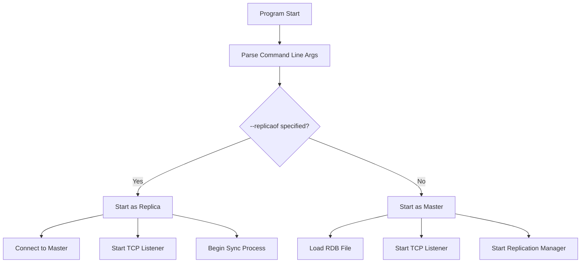
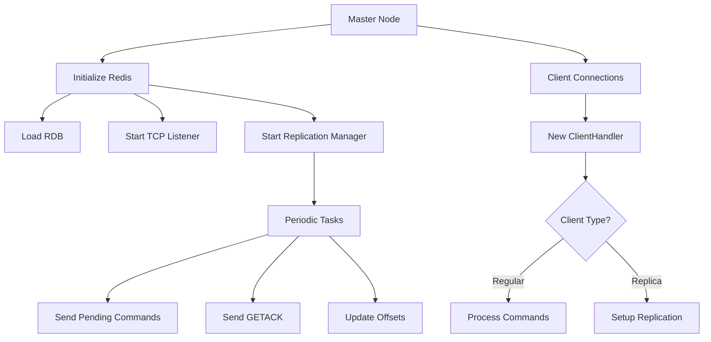
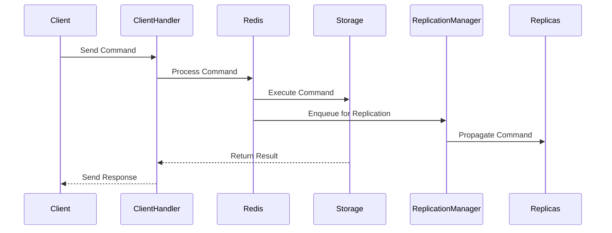
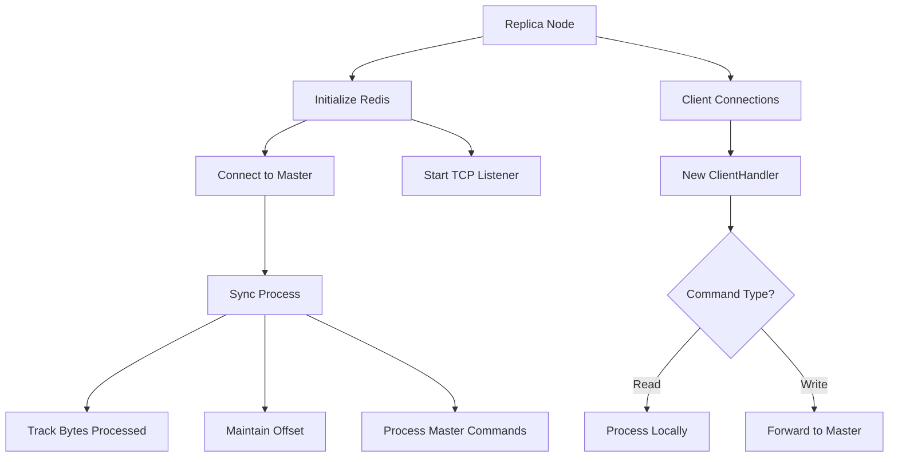
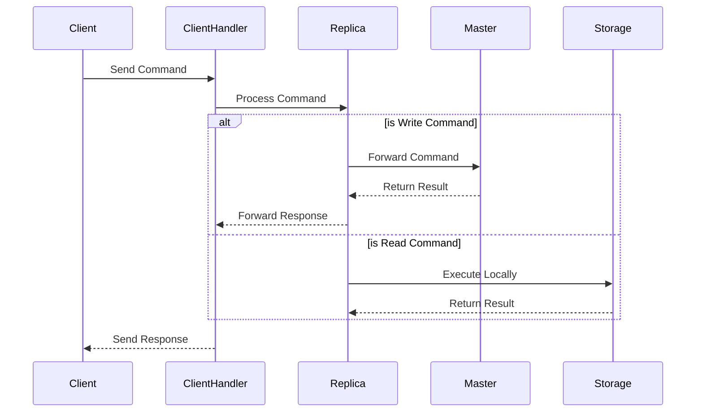
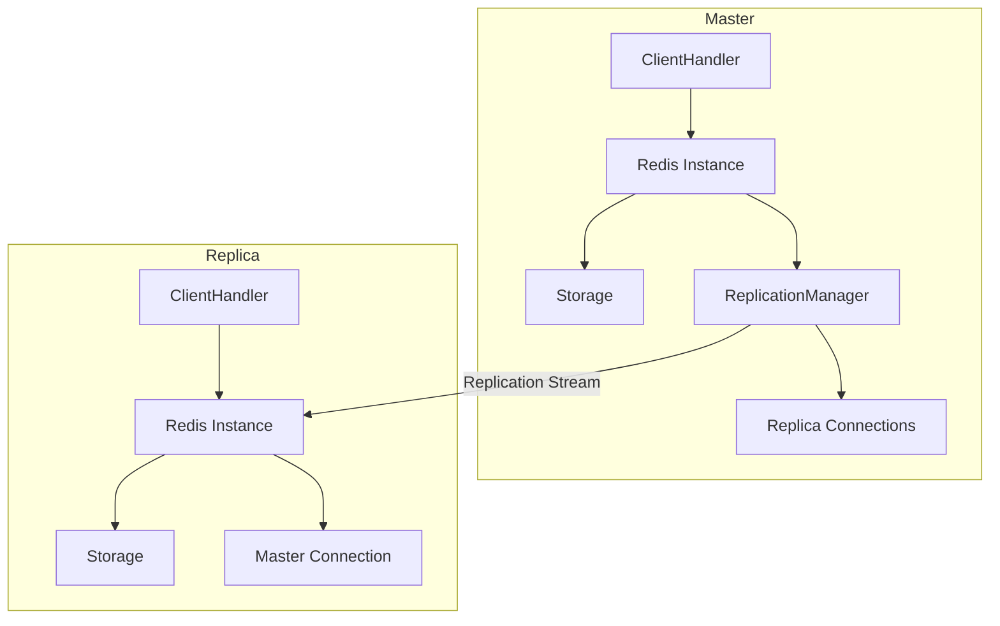
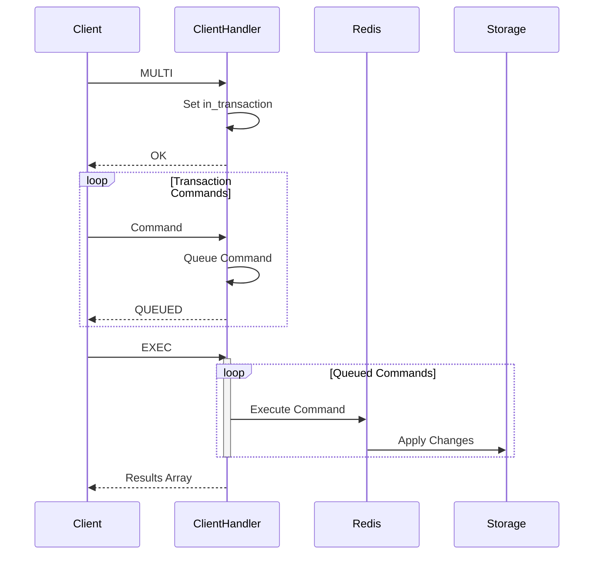
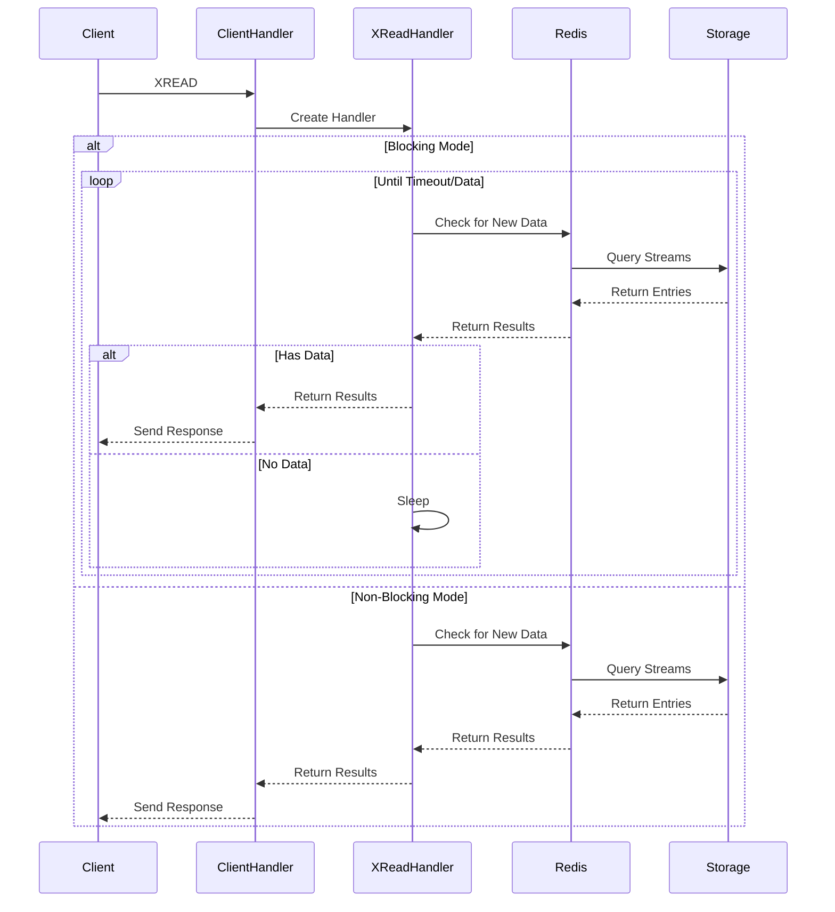
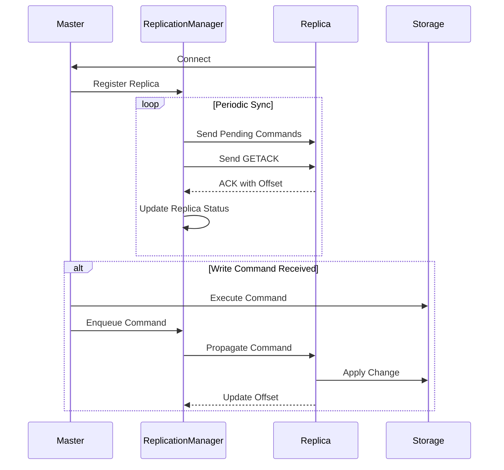

# Redis-like Application Control Flow Documentation

## Main Components

### Core Components

- **Redis Core** (src/redis/core.rs)
  - Main Redis implementation
  - Manages storage and replication
  - Handles command execution and state management
  - Coordinates between all other components

- **Storage** (src/redis/storage.rs)
  - Thread-safe data storage using Mutex<HashMap>
  - Supports strings, lists, sets, and streams
  - Handles key expiration and value wrapping
  - Implements normalize_indices for list operations

- **ReplicationManager** (src/redis/replication.rs)
  - Manages master/replica relationships
  - Handles command replication queue
  - Tracks replication offset and replica status
  - Implements periodic GETACK mechanism

### Client Handling

- **ClientHandler** (src/client_handler.rs)
  - Manages individual client connections
  - Implements RESP protocol parsing
  - Handles transactions (MULTI/EXEC)
  - Routes commands to appropriate handlers

### Specialized Handlers

- **XReadHandler** (src/redis/xread_handler.rs)
  - Dedicated handler for Redis Streams XREAD
  - Supports blocking and non-blocking modes
  - Manages stream entry retrieval and filtering

### Persistence

- **RdbParser** (src/redis/rdb.rs)
  - Handles Redis database file parsing
  - Loads initial state from RDB files
  - Supports graceful handling of missing files

### Protocol

- **RESP Parser** (src/resp/command.rs)
  - Implements Redis protocol parsing
  - Converts raw input to RedisCommand enum
  - Handles all Redis protocol data types

## Startup Flow

## Master Mode Operation

### Command Processing (Master)

## Replica Mode Operation

### Command Processing (Replica)

## Key Components Interaction

## Transaction Flow

## XREAD Command Flow

## Replication Sync Process

